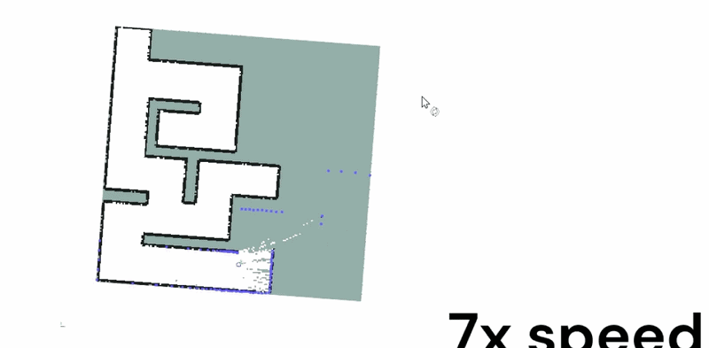
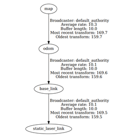
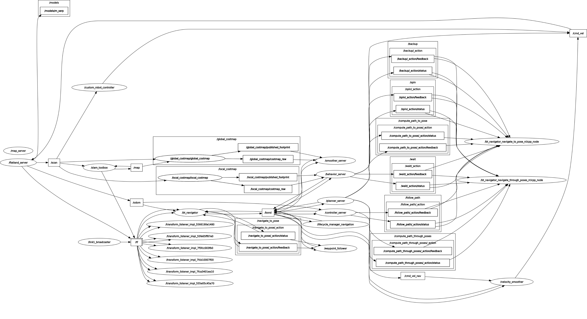

# ROS 2 Flatland Maze Solver

> Autonomous robot navigation pipeline using **SLAM**, **Nav2**, and the **Flatland 2D simulator** — built on ROS 2 Humble.


---

## 📖 About

This project demonstrates a complete robot navigation pipeline where a robot is placed in a **maze-like 2D environment** and must:

1. **Explore** the environment and build a map using SLAM
2. **Localize** itself within the saved map
3. **Navigate autonomously** to a goal using Nav2

Flatland is a lightweight 2D simulator ideal for fast robotics prototyping — no heavy 3D simulation overhead required.



**Key technologies used:**

| Component | Tool |
|-----------|------|
| 🧠 SLAM | `slam_toolbox` |
| 🗺️ Path Planning & Navigation | `Nav2` |
| 🤖 Robot Simulation | `Flatland` |
| 🎮 Robot Control | Custom Python node |

---

## 📁 Project Structure

```
ros2-flatland-maze-solver/
├── flatland_quick_start_ros2/
│   ├── launch/              # Launch files for simulation
│   ├── scripts/             # Custom robot controller node
│   └── flatland_worlds/     # Maze environment definitions
├── install/                 # Colcon install space
├── build/                   # Colcon build space
└── log/                     # Build & runtime logs
```

---

##  Requirements

- **OS:** Ubuntu 22.04
- **ROS:** ROS 2 Humble
- **Build tool:** colcon

### Install ROS 2 dependencies

```bash
sudo apt install \
  ros-humble-navigation2 \
  ros-humble-nav2-bringup \
  ros-humble-slam-toolbox \
  ros-humble-rmw-cyclonedds-cpp
```

---

##  Environment Setup

### Configure Cyclone DDS (recommended for Nav2)

```bash
echo "export RMW_IMPLEMENTATION=rmw_cyclonedds_cpp" >> ~/.bashrc
source ~/.bashrc
```

---

##  Build & Install

```bash
git clone https://github.com/jurajzilka/ros2-flatland-maze-solver.git
cd ros2-flatland-maze-solver

colcon build
source install/setup.bash
```

> ⚠️ **Note:** Run `source install/setup.bash` in **every new terminal** before using any ROS 2 commands from this workspace.

---

##  Phase 1 — SLAM Mapping

Open **4 separate terminals** and run each command in order:

**Terminal 1 — Simulation**
```bash
ros2 launch flatland_quick_start_ros2 flatland_rviz.launch.xml
```

**Terminal 2 — Navigation stack**
```bash
ros2 launch nav2_bringup navigation_launch.py
```

**Terminal 3 — SLAM**
```bash
ros2 launch slam_toolbox online_async_launch.py
```

**Terminal 4 — Robot controller**
```bash
ros2 run flatland_quick_start_ros2 custom_robot_controller.py
```

Drive the robot around to scan the maze. Once done, save the map.

###  Save the Map

```bash
ros2 run nav2_map_server map_saver_cli \
  -f src/flatland_quick_start_ros2/flatland_worlds/maze/scanned_map
```

This generates two files:
- `scanned_map.pgm` — the occupancy grid image
- `scanned_map.yaml` — map metadata

---

##  Phase 2 — Autonomous Navigation

With the map saved, launch the full navigation stack:

```bash
# Terminal 1
ros2 launch flatland_quick_start_ros2 flatland_rviz.launch.xml

# Terminal 2
ros2 launch nav2_bringup navigation_launch.py

# Terminal 3
ros2 run nav2_util lifecycle_bringup map_server
```

Then open the Nav2 RViz view:

```bash
ros2 run rviz2 rviz2 \
  -d /opt/ros/humble/share/nav2_bringup/rviz/nav2_default_view.rviz
```

###  Set a Navigation Goal

In RViz, use the **"2D Nav Goal"** tool to click a destination on the map.

The robot will automatically:
- plan an optimal path
- avoid obstacles
- drive to the target

---

##  How It Works

```
LiDAR data → SLAM → Occupancy Map → Nav2 Localization → Path Planning → Velocity Commands → Robot
```

1. **SLAM** — The robot uses LiDAR scans to build a real-time occupancy grid map
2. **Localization** — Nav2 localizes the robot within the saved map using AMCL
3. **Path Planning** — Nav2 computes a path using global + local planners
4. **Control** — Velocity commands (`/cmd_vel`) are published to move the robot safely

This reflects a standard robotics pipeline used in real-world autonomous systems.

###  TF Transform Tree

The robot uses the following chain of coordinate frames:



| Frame | Description |
|-------|-------------|
| `map` | Global fixed frame — the saved occupancy map |
| `odom` | Odometry frame — tracks robot movement over time |
| `base_link` | Robot body center |
| `static_laser_link` | LiDAR sensor frame |

###  ROS 2 Node Graph

Full graph of all active ROS 2 nodes and topics during navigation (generated via `rqt_graph`):




---

##  Customization

**Modify SLAM parameters:**
```
/opt/ros/humble/share/slam_toolbox/config/
```

**Create custom maze environments:**
```
flatland_quick_start_ros2/flatland_worlds/
```

**Adjust robot controller behavior:**
```
flatland_quick_start_ros2/scripts/custom_robot_controller.py
```

---

## 🛠️ Troubleshooting

**Commands not found / package not found**
```bash
source install/setup.bash
```

**Robot is not moving**
- Confirm the controller node is running in Terminal 4
- Check that the `/cmd_vel` topic is being published:
  ```bash
  ros2 topic echo /cmd_vel
  ```

**Nav2 lifecycle errors**
- Make sure the map server is active before setting a goal
- Verify TF frames are publishing correctly:
  ```bash
  ros2 run tf2_tools view_frames
  ```
- Required frames: `base_link`, `odom`, `map`

---

##  Learning Outcomes

By working through this project you will understand:

- ROS 2 node & topic architecture
- The difference between SLAM and localization
- How Nav2 global & local planners work together
- The full simulation-to-navigation pipeline

---


##  Contributing

Contributions are welcome! Feel free to:
- Open an issue to report bugs or suggest features
- Submit a pull request with improvements

---

##  Acknowledgments

- [ROS 2 Community](https://docs.ros.org/en/humble/)
- [Nav2 Developers](https://nav2.org/)
- [SLAM Toolbox](https://github.com/SteveMacenski/slam_toolbox)
- [Flatland Simulator](https://flatland-simulator.readthedocs.io/)

---
##  Developers

|Name | Username | GitHub |
|---|----------|--------|
| Tomas Novotny | **TomasN123** | [@TomasN123](https://github.com/TomasN123) |
| Juraj Zilka | **jurajzilka** | [@jurajzilka](https://github.com/jurajzilka) |
